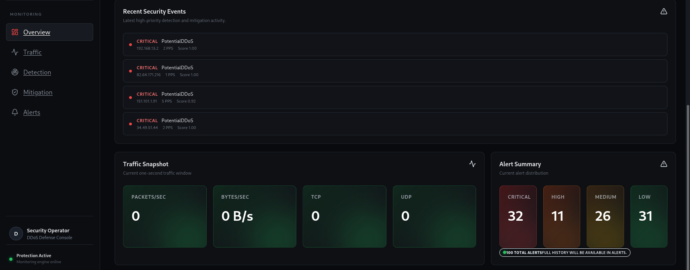
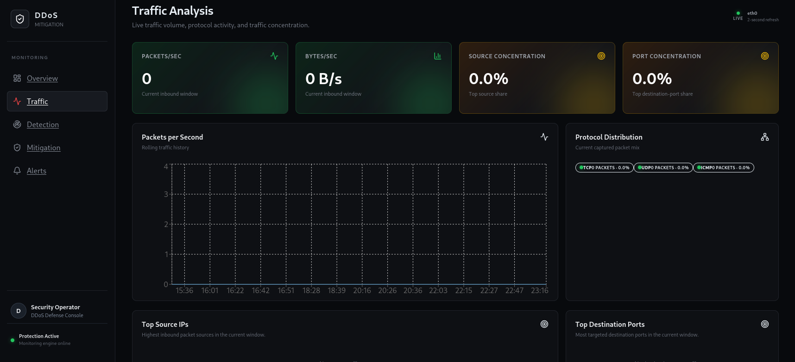
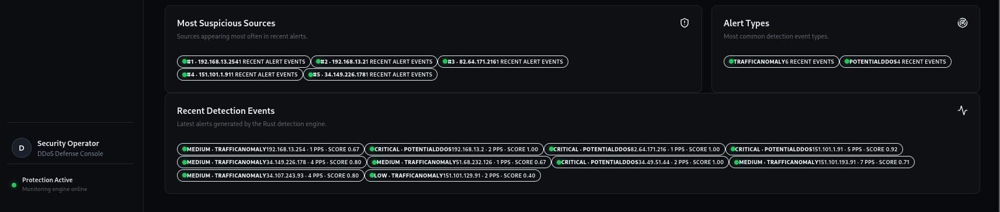

# DDoS Mitigation Tool

A Rust-based defensive DDoS mitigation tool for monitoring network traffic, detecting anomalies, and automatically blocking suspicious source IP addresses.

The project combines packet capture, statistical anomaly detection, eBPF/XDP, nftables, and a React dashboard.

---

## Dashboard

The project includes a real-time dashboard for monitoring traffic, detection events, alerts, and mitigation status.

### Overview




The Overview page provides the main operational view of the system, including:

- Engine status
- XDP status
- Current anomaly score
- Active blocked IPs
- Live traffic history
- Protection status
- Recent security events
- Traffic statistics
- Alert summary

### Traffic Analysis



The Traffic page focuses on current network activity and traffic concentration.

It provides:

- Packets per second
- Bytes per second
- Source IP concentration
- Destination port concentration
- Traffic history
- Protocol distribution
- Top source IPs
- Top destination ports

### Detection & Threat Analysis




The Detection page shows the current detection state and stored security events.

It includes:

- Anomaly score
- Z-score
- Critical alerts
- High alerts
- Detection history
- Severity distribution
- Most suspicious sources
- Alert types
- Recent detection events

### Mitigation


The Mitigation page shows the current enforcement state and mitigation history.

It includes:

- XDP status
- Firewall status
- Active blocks
- Protected IPs
- Protection configuration
- Currently blocked sources
- Mitigation history

### Alerts


The Alerts page provides the retained alert history.

Alerts can be searched and filtered by information such as:

- Source IP
- Alert type
- Severity
- Packet rate
- Anomaly score
- Alert message

---

## Contents

- [Dashboard](#dashboard)
- [About](#about)
- [Features](#features)
- [Architecture](#architecture)
- [Project Structure](#project-structure)
- [Technologies](#technologies)
- [Requirements](#requirements)
- [Installation](#installation)
- [Configuration](#configuration)
- [Running the Project](#running-the-project)
- [How Detection Works](#how-detection-works)
- [How Mitigation Works](#how-mitigation-works)
- [eBPF/XDP](#ebpfxdp)
- [Firewall Enforcement](#firewall-enforcement)
- [Testing](#testing)
- [Useful Commands](#useful-commands)
- [Security Notes](#security-notes)
- [Limitations](#limitations)
- [Future Improvements](#future-improvements)
- [Project Status](#project-status)

---

## About

This project is a defensive network security tool written in Rust.

It captures network traffic, extracts traffic statistics, detects abnormal behavior, generates security alerts, and can automatically mitigate suspicious source IP addresses.

The mitigation layer uses:

- eBPF/XDP for early packet filtering
- nftables for firewall enforcement

The project was developed and tested in a controlled Kali Linux and Metasploitable lab environment.

---

## Features

### Traffic Monitoring

- Real-time packet capture
- Packet and byte statistics
- Packets-per-second monitoring
- Bytes-per-second monitoring
- TCP, UDP and ICMP parsing
- Source IP tracking
- Destination port tracking
- Traffic history

### Detection

- Statistical anomaly detection
- Z-score analysis
- Source IP concentration analysis
- Destination port concentration analysis
- Combined anomaly score
- Security alert generation
- Alert severity levels
- Persistent alert history

### Mitigation

- Automatic IP blocking
- Configurable mitigation threshold
- Configurable block duration
- Protected IP support
- Active block tracking
- Automatic block expiration
- Mitigation history

### Enforcement

- eBPF/XDP packet filtering
- nftables firewall enforcement
- XDP blocked-IP map
- Timed firewall blocks
- Automatic recovery after block expiration

### Dashboard

- Real-time system status
- Traffic monitoring
- Detection analysis
- Mitigation monitoring
- Alert history
- Security event history
- Traffic charts and statistics

---

## Architecture

The project is divided into several main components.

### Packet Capture

The capture layer receives network packets from the configured interface and extracts relevant information such as:

- Source IP
- Destination IP
- Protocol
- Destination port
- Packet size

### Traffic Statistics

The application maintains traffic statistics over short time windows.

These statistics are used by the detection engine to identify abnormal traffic behavior.

### Detection Engine

The detection engine analyzes traffic using statistical signals such as:

- Packet rate
- Z-score
- Source concentration
- Destination port concentration

These signals are combined into an anomaly score.

### Mitigation Manager

When the anomaly score reaches the configured mitigation threshold, the mitigation manager checks whether the source IP should be blocked.

Protected IPs are excluded from automatic mitigation.

### Enforcement

When mitigation is applied, the source IP can be enforced through both:

- eBPF/XDP
- nftables

### API

The Rust backend exposes the current system state through an Axum API.

The frontend uses this API to display live traffic and security information.

### Dashboard

The React dashboard provides the interface for monitoring:

- Traffic
- Detection
- Alerts
- Active mitigation
- Mitigation history
- Protection status

---

## Project Structure

```text
ddos-mitigation-tool/
├── ebpf/
│   └── xdp_test.c
│
├── frontend/
│   ├── src/
│   ├── package.json
│   └── vite.config.ts
│
├── src/
│   ├── alerts/
│   ├── analysis/
│   ├── api/
│   ├── capture/
│   ├── config/
│   ├── detection/
│   ├── metrics/
│   ├── mitigation/
│   └── main.rs
│
├── docs/
│   └── screenshots/
│       ├── overview-1.png
│       ├── overview-2.png
│       ├── traffic.png
│       ├── detection-1.png
│       ├── detection-2.png
│       ├── mitigation.png
│       └── alerts.png
│
├── .env.example
├── Cargo.toml
├── Cargo.lock
└── README.md
```

---

## Technologies

| Component | Technology |
|---|---|
| Main language | Rust |
| Async runtime | Tokio |
| Packet capture | pcap |
| Packet parsing | etherparse |
| API | Axum |
| Serialization | Serde / JSON |
| Logging | tracing |
| eBPF framework | Aya |
| Packet filtering | eBPF / XDP |
| Firewall | nftables |
| Frontend | React |
| Frontend language | TypeScript |
| Frontend tooling | Vite |
| Charts | Recharts |
| HTTP client | Axios |

---

## Requirements

The project is mainly intended for Linux because the enforcement layer uses XDP and nftables.

### Required

- Linux
- Rust and Cargo
- Clang / LLVM
- libpcap
- nftables
- Node.js
- Yarn

Root privileges are required for packet capture and operations involving XDP and nftables.

The project was developed and tested on Kali Linux.

---

## Installation

Clone the repository:

```bash
git clone https://github.com/imeenz/ddos-mitigation-tool.git
cd ddos-mitigation-tool
```

Build the Rust application:

```bash
cargo build
```

Install the frontend dependencies:

```bash
cd frontend
yarn install
cd ..
```

Create the local environment file:

```bash
cp .env.example .env
```

The `.env` file contains local configuration and should not be committed.

---

## Configuration

The main configuration is stored in `.env`.

Example:

```env
APP_NAME=ddos-mitigation-tool
APP_ENV=development
LOG_LEVEL=info

MITIGATION_SCORE_THRESHOLD=0.40
MITIGATION_BLOCK_DURATION_SECS=60
MITIGATION_ENFORCEMENT_ENABLED=true
MITIGATION_PROTECTED_IPS=192.168.13.128
```

### Configuration Variables

| Variable | Description |
|---|---|
| `APP_NAME` | Application name |
| `APP_ENV` | Application environment |
| `LOG_LEVEL` | Logging level |
| `MITIGATION_SCORE_THRESHOLD` | Score required to trigger mitigation |
| `MITIGATION_BLOCK_DURATION_SECS` | Duration of an active block |
| `MITIGATION_ENFORCEMENT_ENABLED` | Enables mitigation enforcement |
| `MITIGATION_PROTECTED_IPS` | IP addresses excluded from automatic mitigation |

Protected IPs are checked before mitigation is applied.

---

## Running the Project

### Start the Rust Engine

From the project directory:

```bash
sudo ./target/debug/ddos-mitigation-tool
```

The API runs on:

```text
http://127.0.0.1:3000
```

Check the current system state:

```bash
curl -s http://127.0.0.1:3000/api/state
```

### Start the Dashboard

Open another terminal:

```bash
cd frontend
yarn dev --host 0.0.0.0 --port 5173
```

Then open:

```text
http://localhost:5173/
```

---

## How Detection Works

The detection engine analyzes traffic over short time windows.

The main detection signals are:

### Packets Per Second

The engine tracks the number of packets received during the current traffic window.

### Z-Score

The Z-score measures how far the current traffic level is from the observed baseline.

### Source Concentration

The engine checks how much of the traffic is coming from the most active source IPs.

### Port Concentration

The engine checks how concentrated the traffic is around destination ports.

### Anomaly Score

These signals are combined into an anomaly score.

When the score reaches the configured mitigation threshold, the source IP is evaluated by the mitigation layer.

A detected anomaly does not automatically mean that the IP will be blocked. Protected IPs and mitigation configuration are checked first.

---

## How Mitigation Works

When a source reaches the configured mitigation threshold:

1. The source IP is identified.
2. The protected IP list is checked.
3. Protected IPs are excluded from automatic mitigation.
4. If the IP is not protected, the mitigation manager can apply a block.
5. The IP is added to the XDP blocked-IP map.
6. The IP can also be added to the nftables blocked-IP set.
7. The active block is tracked by the application.
8. After the configured duration, the active block expires.
9. The IP is removed from the active mitigation state.
10. The mitigation event remains available in the history.

---

## eBPF/XDP

XDP is used to filter packets early in the Linux networking path.

The XDP program checks the source IPv4 address against a blocked-IP map.

If the source IP is present in the map, the packet is dropped.

Otherwise, the packet continues through the normal networking path.

The Rust application uses Aya to interact with the eBPF program.

### Compile the XDP Program

```bash
clang -O2 -g -target bpf \
  -I/usr/include/x86_64-linux-gnu \
  -c ebpf/xdp_test.c \
  -o ebpf/xdp_test.o
```

### Attach XDP

```bash
sudo ip link set dev eth0 xdp obj ebpf/xdp_test.o sec xdp
```

### Detach XDP

```bash
sudo ip link set dev eth0 xdp off
```

The network interface may be different on another system.

The blocked-IP map is pinned under:

```text
/sys/fs/bpf/ddos-mitigation/blocked_ips
```

Check the map:

```bash
sudo bpftool map dump name blocked_ips
```

---

## Firewall Enforcement

The project uses nftables as a second enforcement layer.

The application manages the `inet ddos_mitigation` table and its `blocked_ips` set.

Check the current blocked-IP set:

```bash
sudo nft list set inet ddos_mitigation blocked_ips
```

The enforcement layers serve different purposes:

- **eBPF/XDP** provides early packet filtering.
- **nftables** provides firewall-level enforcement and timed entries.

Using both layers also provides a way to verify that mitigation is being applied at both the XDP and firewall levels.

---

## Testing

Testing was performed in a controlled lab environment using Kali Linux and Metasploitable.

### Lab Environment

| System | IP |
|---|---|
| Metasploitable | `192.168.13.128` |
| Kali Linux | `192.168.13.130` |

### Tested Components

| Test | Result |
|---|---|
| Engine / API | PASS |
| Normal traffic | PASS |
| ICMP traffic | PASS |
| UDP traffic | PASS |
| Anomaly detection | PASS |
| Protected IP handling | PASS |
| XDP enforcement | PASS |
| nftables enforcement | PASS |
| Automatic mitigation | PASS |
| Block expiration | PASS |
| Firewall recovery | PASS |
| Dashboard state | PASS |
| Rust test suite | PASS |

### Protected IP Test

A protected IP was used to verify that detection does not automatically lead to blocking.

The engine detected the traffic but skipped mitigation:

```text
ANOMALY DETECTED

MITIGATION: skipped — protected local IP 192.168.13.128
Blocked IPs: 0
```

### Automatic Mitigation Test

For the controlled mitigation test, the protected-IP exception was temporarily removed.

The engine then applied mitigation:

```text
XDP: blocked IP 192.168.13.128 added to eBPF map
MITIGATION: Block applied to source IP 192.168.13.128
Currently blocked IPs: 1
ENFORCEMENT: firewall block applied to 192.168.13.128
```

The test traffic was then blocked.

### Block Expiration Test

The configured block duration was tested.

After expiration, the active block returned to zero and the nftables set was checked to confirm that the expired block was no longer active.

This verified the complete mitigation and recovery cycle.

### Rust Tests

Run the Rust test suite with:

```bash
cargo test
```

---

## Useful Commands

### Build

```bash
cargo build
```

### Run Tests

```bash
cargo test
```

### Run the Engine

```bash
sudo ./target/debug/ddos-mitigation-tool
```

### Start the Frontend

```bash
cd frontend
yarn dev --host 0.0.0.0 --port 5173
```

### Check API State

```bash
curl -s http://127.0.0.1:3000/api/state | python3 -m json.tool
```

### Check nftables

```bash
sudo nft list set inet ddos_mitigation blocked_ips
```

### Check XDP Map

```bash
sudo bpftool map dump name blocked_ips
```

### Check Git Status

```bash
git status
```

---

## Security Notes

This project is intended for defensive security research, education, and authorized testing.

- Only test against systems and networks you own or are authorized to test.
- XDP and nftables operations require elevated privileges.
- An aggressive detection threshold can result in legitimate traffic being blocked.
- Protected IPs should be configured carefully.
- The dashboard/API should not be exposed publicly without appropriate access controls.
- XDP support depends on the Linux kernel, network interface, and driver.
- Detection thresholds should be tuned for the environment where the system is deployed.

---

## Limitations

The current version is a functional prototype validated in a controlled lab environment.

Current limitations include:

- Linux is required for the XDP and nftables enforcement layer.
- Detection is based on statistical analysis rather than machine learning.
- Detection thresholds need to be tuned for different environments.
- XDP support depends on the Linux kernel, network interface, and driver.
- Testing was performed in a controlled laboratory environment.
- The current system is designed as a local mitigation engine rather than a distributed DDoS protection platform.

---

## Future Improvements

Possible future work includes:

- Machine-learning-based traffic classification
- Distributed detection sensors
- Centralized SIEM integration
- Threat intelligence integration
- More advanced rate limiting
- Improved TCP traffic analysis
- Centralized event storage
- High-availability deployment
- Containerized deployment
- Cloud-based monitoring

---

## Project Status

The current version is a functional prototype.

Implemented components include:

- Real-time packet capture
- Traffic statistics
- Protocol detection
- Statistical anomaly detection
- Security alerts
- Automatic IP mitigation
- eBPF/XDP enforcement
- nftables enforcement
- Protected IP handling
- Timed block expiration
- Metrics and persistence
- Axum API
- React dashboard

The system has been tested in a controlled Kali Linux and Metasploitable environment.
