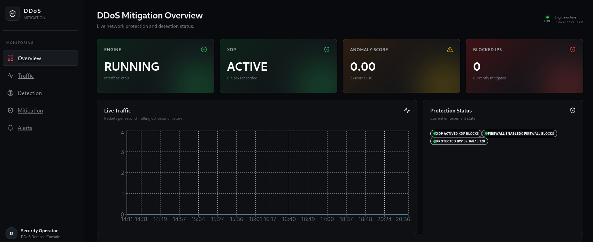
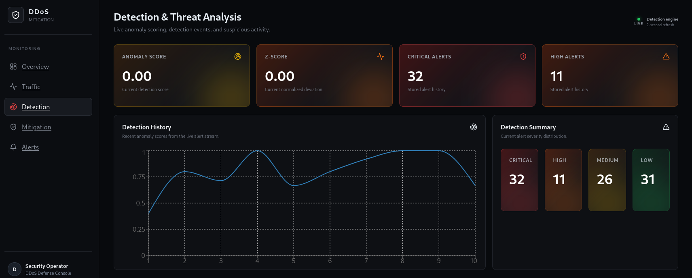
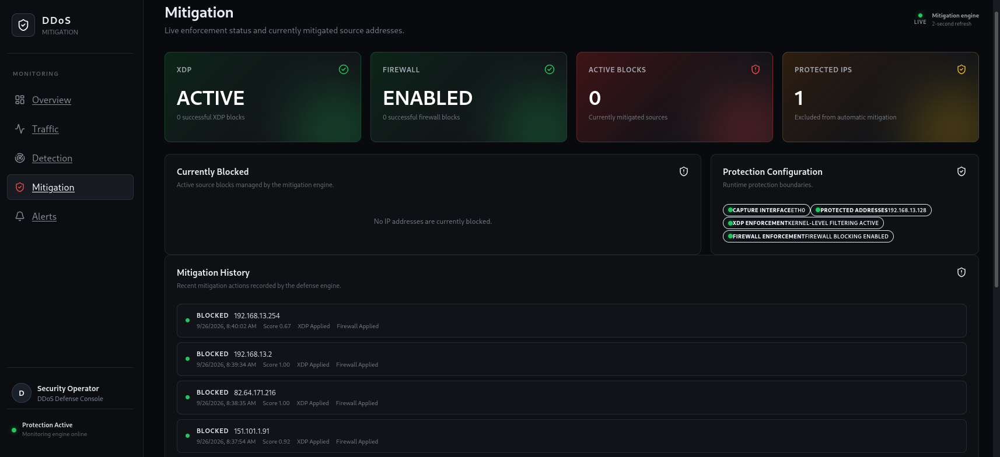
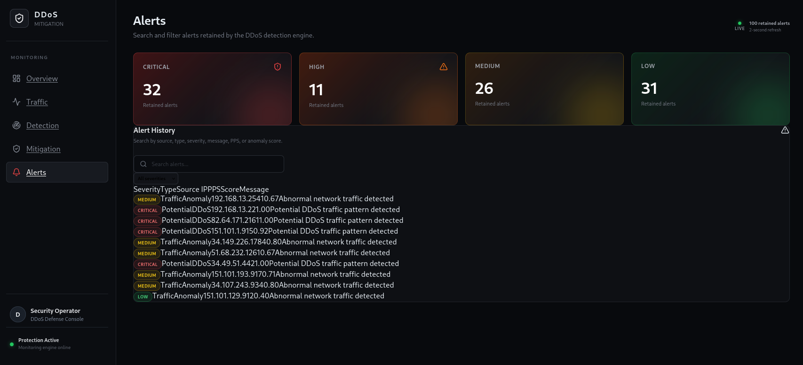

# DDoS Attack and Mitigation Tool

A Rust-based defensive network security tool designed to monitor network traffic, detect abnormal activity, generate security alerts, and automatically mitigate suspicious source IP addresses. The project combines packet capture, statistical anomaly detection, eBPF/XDP, nftables, and a React dashboard to provide real-time visibility and network-level response in a controlled lab environment.



## Technologies Used

| Category | Technologies |
|---|---|
| Backend | Rust, Tokio, Axum |
| Network | pcap, etherparse |
| Detection | Statistical analysis, Z-score |
| Mitigation | eBPF/XDP, Aya, nftables |
| Frontend | React, TypeScript, Vite |
| Visualization | Recharts |
| Data | Serde / JSON |
| Development | Cargo, Yarn, Git |

## Lab Environment

| System | IP |
|---|---|
| Metasploitable | `192.168.13.128` |
| Kali Linux | `192.168.13.130` |

## Contents

- [Security Response](#security-response)
- [Architecture](#architecture)
- [Requirements](#requirements)
- [Installation](#installation)
- [Configuration](#configuration)
- [How to Run](#how-to-run)
- [eBPF/XDP](#ebpfxdp)
- [Firewall Enforcement](#firewall-enforcement)
- [Testing](#testing)
- [Useful Commands](#useful-commands)
- [Security Considerations](#security-considerations)
- [Limitations](#limitations)

## Security Response

### Detection



The Detection page provides a view of the current detection state and retained security events. It includes the anomaly score, Z-score, alert severity counts, detection history, suspicious sources, alert types, and recent detection events.

### Mitigation



The Mitigation page shows the current enforcement state and mitigation history. It provides information about XDP and firewall status, active blocked IPs, protected IPs, protection configuration, and previous mitigation events.

### Alerts



The Alerts page provides the retained security alert history. Alerts can be reviewed using information such as source IP, alert type, severity, packet rate, anomaly score, and alert message.

## Architecture

```text
ddos-mitigation-tool/
├── ebpf/
│   └── xdp_test.c
│
├── frontend/
│   ├── src/
│   ├── package.json
│   └── vite.config.ts
│
├── src/
│   ├── alerts/
│   ├── analysis/
│   ├── api/
│   ├── capture/
│   ├── config/
│   ├── detection/
│   ├── metrics/
│   ├── mitigation/
│   └── main.rs
│
├── docs/
│   └── screenshots/
│       ├── overview-1.png
│       ├── overview-2.png
│       ├── traffic.png
│       ├── detection-1.png
│       ├── detection-2.png
│       ├── mitigation.png
│       └── alerts.png
│
├── .env.example
├── Cargo.toml
├── Cargo.lock
└── README.md
```

## Requirements

The project is mainly intended for Linux because the mitigation layer uses XDP and nftables.

### Required

- Linux
- Rust and Cargo
- Clang / LLVM
- libpcap
- nftables
- Node.js
- Yarn

Root privileges are required for packet capture and operations involving XDP and nftables.

The project was developed and tested on Kali Linux.

## Installation

Clone the repository:

```bash
git clone https://github.com/imeenz/ddos-mitigation-tool.git
cd ddos-mitigation-tool
```

Build the Rust application:

```bash
cargo build
```

Install the frontend dependencies:

```bash
cd frontend
yarn install
cd ..
```

Create the local environment file:

```bash
cp .env.example .env
```

The `.env` file contains local configuration and should not be committed.

## Configuration

The main configuration is stored in `.env`.

Example:

```env
APP_NAME=ddos-mitigation-tool
APP_ENV=development
LOG_LEVEL=info

MITIGATION_SCORE_THRESHOLD=0.40
MITIGATION_BLOCK_DURATION_SECS=60
MITIGATION_ENFORCEMENT_ENABLED=true
MITIGATION_PROTECTED_IPS=192.168.13.128
```

Variables

| Variable | Description |
|---|---|
| `APP_NAME` | Application name |
| `APP_ENV` | Application environment |
| `LOG_LEVEL` | Logging level |
| `MITIGATION_SCORE_THRESHOLD` | Score required to trigger mitigation |
| `MITIGATION_BLOCK_DURATION_SECS` | Duration of an active block |
| `MITIGATION_ENFORCEMENT_ENABLED` | Enables mitigation enforcement |
| `MITIGATION_PROTECTED_IPS` | IP addresses excluded from automatic mitigation |

Protected IPs are checked before mitigation is applied.

## How to Run

### Start the Rust Engine

From the project directory:

```bash
sudo ./target/debug/ddos-mitigation-tool
```

The API runs on:

```text
http://127.0.0.1:3000
```

Check the current system state:

```bash
curl -s http://127.0.0.1:3000/api/state
```

### Start the Dashboard

Open another terminal:

```bash
cd frontend
yarn dev --host 0.0.0.0 --port 5173
```

Then open:

```text
http://localhost:5173/
```

## eBPF/XDP

XDP is used to filter packets early in the Linux networking path.

The XDP program checks the source IPv4 address against a blocked-IP map.

If the source IP is present in the map, the packet is dropped. Otherwise, the packet continues through the normal networking path.

The Rust application uses Aya to interact with the eBPF program.

### Compile the XDP Program

```bash
clang -O2 -g -target bpf \
  -I/usr/include/x86_64-linux-gnu \
  -c ebpf/xdp_test.c \
  -o ebpf/xdp_test.o
```

### Attach XDP

```bash
sudo ip link set dev eth0 xdp obj ebpf/xdp_test.o sec xdp
```

### Detach XDP

```bash
sudo ip link set dev eth0 xdp off
```

The network interface may be different on another system.

The blocked-IP map is pinned under:

```text
/sys/fs/bpf/ddos-mitigation/blocked_ips
```

Check the map:

```bash
sudo bpftool map dump name blocked_ips
```

## Firewall Enforcement

The project uses nftables as a second enforcement layer.

The application manages the `inet ddos_mitigation` table and its `blocked_ips` set.

Check the current blocked-IP set:

```bash
sudo nft list set inet ddos_mitigation blocked_ips
```

The enforcement layers serve different purposes:

- **eBPF/XDP** provides early packet filtering.
- **nftables** provides firewall-level enforcement and timed entries.

Using both layers also provides a way to verify that mitigation is being applied at both the XDP and firewall levels.

## Testing

Testing was performed in a controlled lab environment using Kali Linux and Metasploitable.

### Tested Components

| Test | Result |
|---|---|
| Engine / API | PASS |
| Normal traffic | PASS |
| ICMP traffic | PASS |
| UDP traffic | PASS |
| Anomaly detection | PASS |
| Protected IP handling | PASS |
| XDP enforcement | PASS |
| nftables enforcement | PASS |
| Automatic mitigation | PASS |
| Block expiration | PASS |
| Firewall recovery | PASS |
| Dashboard state | PASS |
| Rust test suite | PASS |

### Protected IP Test

A protected IP was used to verify that detection does not automatically lead to blocking.

The engine detected the traffic but skipped mitigation:

```text
ANOMALY DETECTED

MITIGATION: skipped — protected local IP 192.168.13.128
Blocked IPs: 0
```

### Automatic Mitigation Test

For the controlled mitigation test, the protected-IP exception was temporarily removed.

The engine then applied mitigation:

```text
XDP: blocked IP 192.168.13.128 added to eBPF map
MITIGATION: Block applied to source IP 192.168.13.128
Currently blocked IPs: 1
ENFORCEMENT: firewall block applied to 192.168.13.128
```

The test traffic was then blocked.

### Block Expiration Test

The configured block duration was tested.

After expiration, the active block returned to zero and the nftables set was checked to confirm that the expired block was no longer active.

This verified the mitigation and recovery cycle.

### Rust Tests

Run the Rust test suite with:

```bash
cargo test
```

## Useful Commands

### Build

```bash
cargo build
```

### Run Tests

```bash
cargo test
```

### Run the Engine

```bash
sudo ./target/debug/ddos-mitigation-tool
```

### Start the Frontend

```bash
cd frontend
yarn dev --host 0.0.0.0 --port 5173
```

### Check API State

```bash
curl -s http://127.0.0.1:3000/api/state | python3 -m json.tool
```

### Check nftables

```bash
sudo nft list set inet ddos_mitigation blocked_ips
```

### Check XDP Map

```bash
sudo bpftool map dump name blocked_ips
```

### Check Git Status

```bash
git status
```

## Security Considerations

This project is intended for defensive security research, education, and authorized testing.

- Only test against systems and networks you own or are authorized to test.
- XDP and nftables operations require elevated privileges.
- An aggressive detection threshold can result in legitimate traffic being blocked.
- Protected IPs should be configured carefully.
- The dashboard/API should not be exposed publicly without appropriate access controls.
- XDP support depends on the Linux kernel, network interface, and driver.
- Detection thresholds should be tuned for the environment where the system is deployed.

## Limitations

The current version is a functional prototype validated in a controlled lab environment.

Current limitations include:

- Linux is required for the XDP and nftables enforcement layer.
- Detection is based on statistical analysis rather than machine learning.
- Detection thresholds need to be tuned for different environments.
- XDP support depends on the Linux kernel, network interface, and driver.
- Testing was performed in a controlled laboratory environment.
- The current system is designed as a local mitigation engine rather than a distributed DDoS protection platform.
